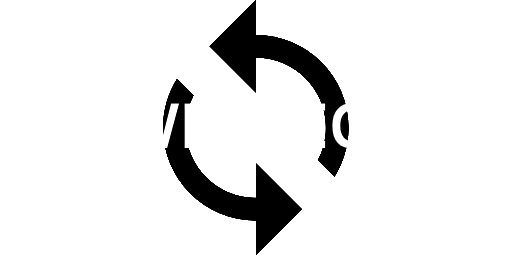

<h1 align="center">Eventica</h1>

Library for event handling in GameMaker by <a href="" target="_blank">AlexInCube</a>

<a href="https://github.com/AlexInCube/Eventica/releases/">Download the .yymps</a>

&nbsp;

## What is this? {docsify-ignore}

Eventica this is a powerful and lightweight library for [event handling.](https://en.wikipedia.org/wiki/Event-driven_programming)

This library is inspired by [EventEmitter2](https://github.com/EventEmitter2/EventEmitter2) package for Node.js

## Features {docsify-ignore}

- Subscription methods for any purpose (.on(), .once(), .many(), ...)
- Structs & Instances as listeners
- Auto-memory management, you don't need to unsubscribe from events manually (but you can do it with .off())
- Prefab support
- [Namespaces & Wildcards](namespaces-and-wildcard)
- [Feather](https://manual.gamemaker.io/monthly/en/index.htm#t=Setting_Up_And_Version_Information%2FIDE_Preferences%2FFeather_Settings.htm) friendly
- [GMTL Tests](https://github.com/DAndrewBox/GM-Testing-Library)

## About & Support {docsify-ignore}

Eventica probably supports all Game Maker platforms, but tested only on Windows.

Eventica is built and maintained by [AlexInCube]()

If you have problems or find a bugs, please create an issue.

## License {docsify-ignore}

Eventica is licensed under the [MIT License](https://github.com/AlexInCube/Eventica/blob/main/LICENSE).